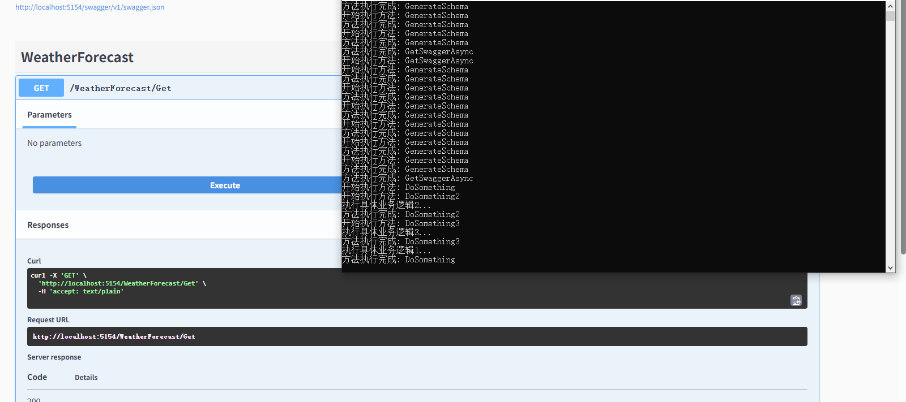
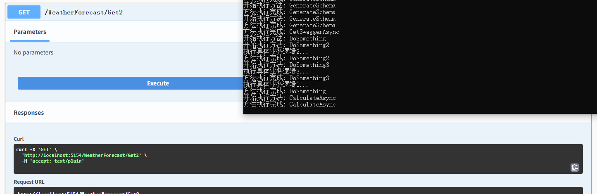
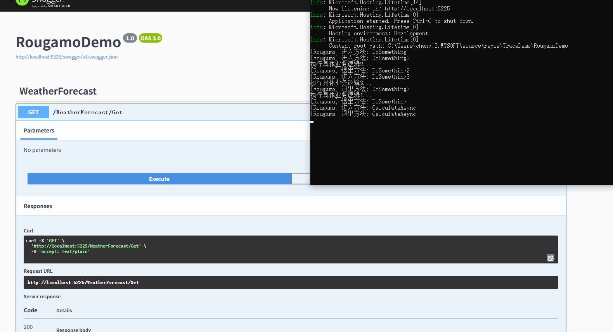
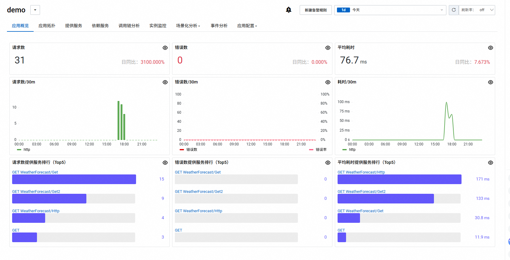
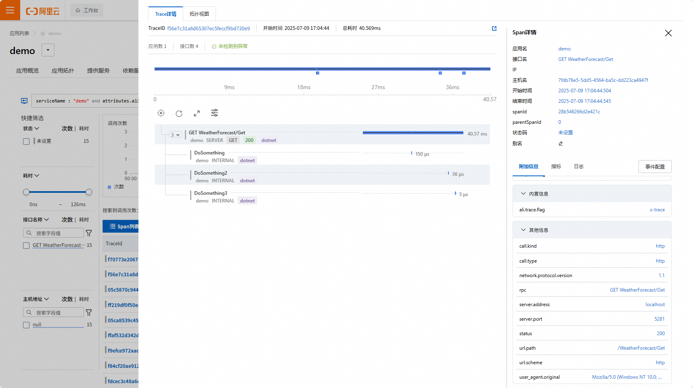
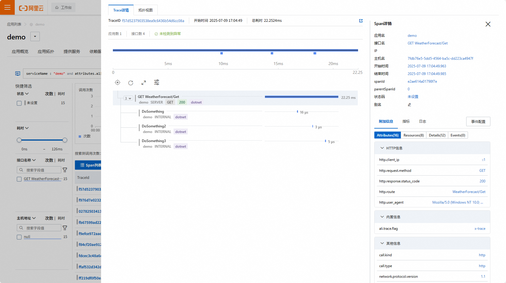
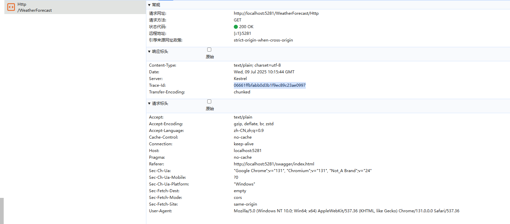
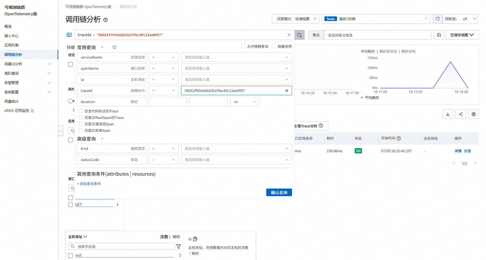
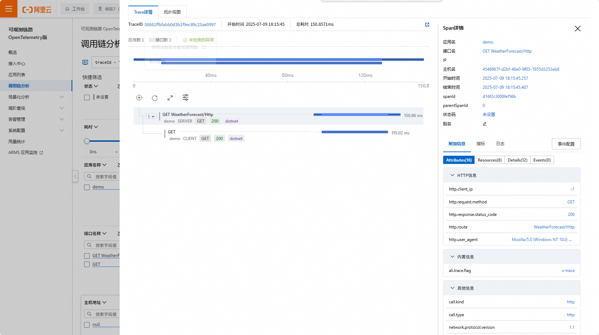

# AopDemo

net8 使用AOP切面，用来记录方法的运行信息，后续上报给日志平台，


## AspectCoreDemo

1. 添加nuget引用
```  xml
	<PackageReference Include="AspectCore.Extensions.DependencyInjection" Version="2.4.0" />
```
2. Program添加拦截器
``` csharp
// 注册拦截器
builder.Host.UseServiceProviderFactory(new DynamicProxyServiceProviderFactory());
builder.Services.ConfigureDynamicProxy(config =>
{
    config.Interceptors.AddTyped<AspectInterceptor>(Predicates.ForService("*"));
});
```

调用方法即可发现被拦截，同步和异步方法均可以拦截




3. 缺点
内部调用方法，必须通过代理对象来调用，否则无法拦截。

``` csharp
public virtual void DoSomething()
{
    // 内部调用方法，要获取代理类调用
    var proxy = _serviceProvider.GetRequiredService<MyService>();
    proxy.DoSomething2();
    proxy.DoSomething3();
    Console.WriteLine("执行具体业务逻辑1...");
}
```


## RougamoDemo
详细使用文档参考  https://github.com/inversionhourglass/Rougamo

1. 添加nuget引用
``` xml
<PackageReference Include="Fody" Version="6.9.2">
	<PrivateAssets>all</PrivateAssets>
	<IncludeAssets>runtime; build; native; contentfiles; analyzers; buildtransitive</IncludeAssets>
</PackageReference>
<PackageReference Include="Rougamo.Fody" Version="5.0.1" />
```

2. 增加特性标记
``` csharp

using Rougamo;
using Rougamo.Context;

namespace RougamoDemo.Core
{
    public class LoggingMoAttribute : MoAttribute
    {
        public override void OnEntry(MethodContext context)
        {
            Console.WriteLine($"[Rougamo] 进入方法: {context.Method.Name}");
        }

        public override void OnExit(MethodContext context)
        {
            Console.WriteLine($"[Rougamo] 退出方法: {context.Method.Name}");
        }
    }
}

```

运行即可，私有方法不能被代理





## 链路跟踪

AOP最终服务于链路追踪

1. 开通阿里云 可观测链路 OpenTelemetry版
2. 点击接入中心，选中net，按向导操作，最终得到示例代码，拿到url地址
3. 配置在电脑环境变量中 `demo_end_point`
4. 项目中引入 OpenTelemetry
``` xml
		<PackageReference Include="OpenTelemetry" Version="1.12.0" />
		<PackageReference Include="OpenTelemetry.Exporter.Console" Version="1.12.0" />
		<PackageReference Include="OpenTelemetry.Exporter.OpenTelemetryProtocol" Version="1.12.0" />
		<PackageReference Include="OpenTelemetry.Extensions.Hosting" Version="1.12.0" />
		<PackageReference Include="OpenTelemetry.Instrumentation.Process" Version="1.12.0-beta.1" />
		<PackageReference Include="OpenTelemetry.Instrumentation.Http" Version="1.12.0" />
		<PackageReference Include="OpenTelemetry.Instrumentation.Runtime" Version="1.12.0" />
		<PackageReference Include="OpenTelemetry.Instrumentation.AspNetCore" Version="1.12.0" />
```
5. 引入 Rougamo
``` xml

		<PackageReference Include="Rougamo.OpenTelemetry" Version="5.0.0" />
		<PackageReference Include="Rougamo.OpenTelemetry.Hosting" Version="5.0.0" />
		<PackageReference Include="Fody" Version="6.9.2">
			<PrivateAssets>all</PrivateAssets>
			<IncludeAssets>runtime; build; native; contentfiles; analyzers; buildtransitive</IncludeAssets>
		</PackageReference>
		<PackageReference Include="Rougamo.Fody" Version="5.0.1" />


```
6. 配置服务跟踪

``` csharp

     builder.Services.AddOpenTelemetry() // 注册 OpenTelemetry 服务
.WithTracing(tracerProviderBuilder => // 配置分布式追踪系统
{
    tracerProviderBuilder
        .AddSource(otelOptions.ServiceName) // 设置活动源名称，作为追踪数据的生产者
          .AddRougamoSource() // 初始化Rougamo.OpenTelemetry
        .SetResourceBuilder( // 配置附加到所有遥测数据的资源信息
            ResourceBuilder.CreateDefault()
                .AddService( // 添加服务标识信息
                    serviceName: otelOptions.ServiceName,
                    serviceVersion: otelOptions.ServiceVersion)
                .AddEnvironmentVariableDetector()) // 从环境变量自动检测资源标签
        .AddAspNetCoreInstrumentation(options => // 自动收集 ASP.NET Core HTTP 服务器数据
        {
            options.RecordException = true; // 记录请求处理中发生的异常
            options.Filter = httpContext => !httpContext.Request.Path.Value.Contains("/health"); // 过滤健康检查端点
            options.EnrichWithHttpRequest = (activity, request) => // 自定义增强 HTTP 请求追踪数据
            {
                activity.SetTag("http.client_ip", request.HttpContext.Connection.RemoteIpAddress); // 添加客户端 IP
                activity.SetTag("http.user_agent", request.Headers.UserAgent.ToString()); // 添加 User-Agent
            };
        })
        .AddHttpClientInstrumentation(options => // 自动收集 HttpClient 发出的请求
        {
            options.RecordException = true; // 记录客户端请求异常
            options.FilterHttpRequestMessage =
                request => !request.RequestUri.AbsolutePath.Contains("/metrics"); // 过滤指标请求
        })
        .SetSampler(new TraceIdRatioBasedSampler(0.1)) // 设置采样策略（10% 采样率，平衡性能与数据量）
        .AddOtlpExporter(options => // 配置 OTLP 导出器，发送数据到目标端点
        {
            options.Endpoint = new Uri(otelOptions.EndPoint); // 设置导出目标地址
            options.Protocol = OtlpExportProtocol.HttpProtobuf; // 使用 HTTP/Protobuf 协议
            options.BatchExportProcessorOptions = new BatchExportProcessorOptions<Activity> // 配置批量导出参数（性能优化）
            {
                MaxQueueSize = 2048, // 最大队列大小，达到此值时开始丢弃
                ScheduledDelayMilliseconds = 1000, // 调度导出的延迟时间（毫秒）
                ExporterTimeoutMilliseconds = 3000, // 导出超时时间（毫秒）
                MaxExportBatchSize = 512 // 单次最大导出批量大小
            };
            // options.Headers = "Authorization=Bearer YOUR_API_KEY";                         // 设置认证头（如需要）
        })
        .AddConsoleExporter(options => // 添加控制台导出器（开发环境调试用）
        {
            options.Targets = ConsoleExporterOutputTargets.Console; // 指定输出目标为控制台
        });
})
.WithMetrics(metricsProviderBuilder => // 配置指标收集系统
{
    metricsProviderBuilder
        .AddMeter(otelOptions.ServiceName) // 设置指标仪表名称，作为指标数据的生产者
        .AddAspNetCoreInstrumentation() // 收集 ASP.NET Core 请求指标
        .AddHttpClientInstrumentation() // 收集 HttpClient 请求指标
        .AddRuntimeInstrumentation() // 收集 .NET 运行时指标（CPU/内存/线程等）
        .AddProcessInstrumentation() // 收集进程级指标（CPU/内存使用等）
        .AddReader(new PeriodicExportingMetricReader(
            new OtlpMetricExporter(new OtlpExporterOptions()
            {
                Endpoint = new Uri(otelOptions.EndPoint),
                Protocol = OtlpExportProtocol.HttpProtobuf
            }),
            exportIntervalMilliseconds: 60000 // 生产环境建议 60 秒
        ))
        // .AddReader(new PeriodicExportingMetricReader(   // 修正后的控制台导出器配置
        //     new ConsoleMetricExporter(new ConsoleExporterOptions()),
        //     exportIntervalMilliseconds: 1000 // 开发环境缩短间隔
        // ))
        ;
});

     // 修改Rougamo.OpenTelemetry默认配置
     builder.Services.AddOpenTelemetryRougamo(options =>
     {
         options.ArgumentsStoreType = ArgumentsStoreType.Tag;
     });

     // 添加自定义活动源，用于手动创建追踪跨度
     builder.Services.AddSingleton<ActivitySource>(sp =>
         new ActivitySource(otelOptions.ServiceName));

     // 配置日志集成，将日志与追踪关联
     builder.Logging.AddOpenTelemetry(options =>
     {
         options.IncludeFormattedMessage = true; // 包含格式化后的日志消息
         options.IncludeScopes = true; // 包含日志范围信息
         options.ParseStateValues = true; // 解析状态值为单独属性
         options.AddOtlpExporter(otlpOptions => // 配置 OTLP 日志导出器
         {
             otlpOptions.Endpoint = new Uri(otelOptions.EndPoint); // 设置日志导出目标地址
             otlpOptions.Protocol = OtlpExportProtocol.HttpProtobuf; // 使用 HTTP/Protobuf 协议
         });
     });


```

7. 常见的请求就能自动记录了，如Http,AspNetCore请求，内存cpu指标
8. Rougamo.OpenTelemetry 用法，可以记录方法的入参和返回值等信息，使用方法见博客
https://www.cnblogs.com/nigture/p/15712899.html

``` csharp

public class Startup
{
    public void ConfigureServices(IServiceCollection services)
    {
        // ...

        services.AddOpenTelemetryTracing(builder =>
        {
            builder
                .AddRougamoSource() // 初始化Rougamo.OpenTelemetry
                .AddAspNetCoreInstrumentation()
                .AddJaegerExporter();
        });

        // 修改Rougamo.OpenTelemetry默认配置
        services.AddOpenTelemetryRougamo(options =>
        {
            options.ArgumentsStoreType = ArgumentsStoreType.Tag;
        });
    }
}

class Service
{
    [return: ApmIgnore]     // 返回值不记录
    [Otel] // 默认记录参数和返回值，需要通过ApmIgnoreAttribute来忽略不需要记录的参数或返回值
    public async Task<string> M1(
            [ApmIgnore] string uid, // 该参数不记录
            DateTime time)
    {
        // do something
        return string.Empty;
    }

    [PureOtel] // 默认不记录参数和返回值，需要通过ApmRecordAttribute来记录指定的参数或返回值
    public void M2(
            [ApmRecord] double d1,  // 记录该参数
            double d2)
    {
        // do something
    }
}

// 通过实现空接口织入
public interface ITestService : IRougamo<FullOtelAttribute>
{
    // ...
}
public class TestService : ITestService
{
    // ...
}

```

访问接口后，上报请求效果截图







9. trace-id 记录

``` 中间件记录

app.Use(async (context, next) =>
{
    context.Response.OnStarting(() =>
    {
        var activity = System.Diagnostics.Activity.Current;
        if (activity != null && !string.IsNullOrEmpty(activity.TraceId.ToString()))
        {
            context.Response.Headers["trace-id"] = activity.TraceId.ToString();
        }
        return Task.CompletedTask;
    });

    await next();
});

```





